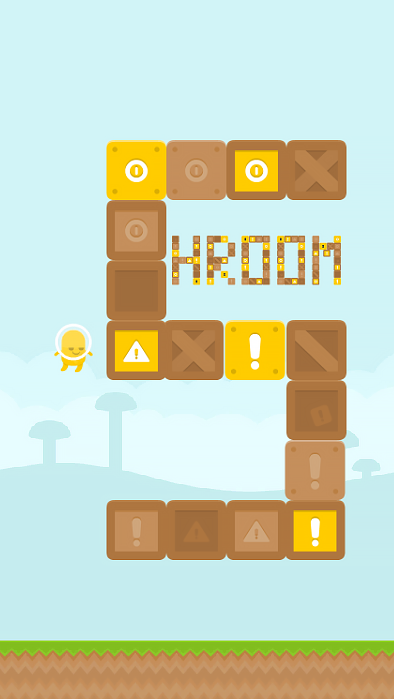

# Shroom 2D

A simple 2D game developed with Unity 5. It mainly serves as an initial project to get acquainted with the engine's tools and capabilities. 

It plays like Flappy Bird, with moving platforms spawning after a set number of points.

## Assets

- Sprites from [Kenney's Platformer Pack](http://kenney.nl/assets)

## Screenshots

 

Larger resolutions (tablet or desktop) are also supported.
